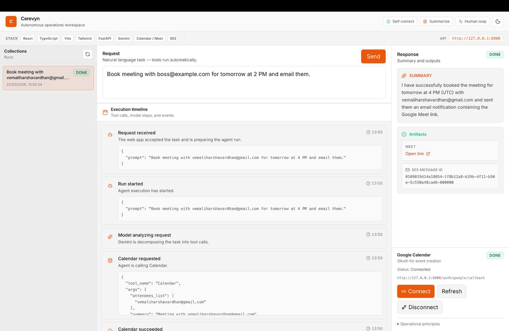
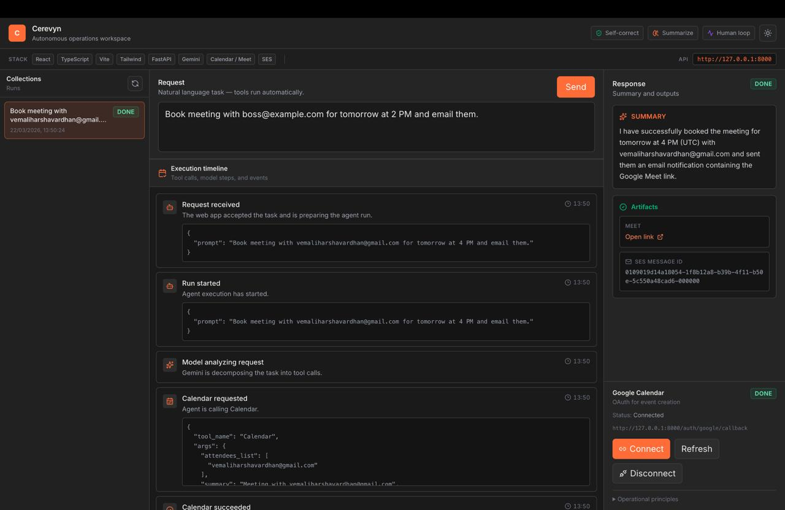

<p align="center">
  
  
  
  
</p>

<p align="center">
  
  
  
  
  
  
  
  
  
  
  
  
</p>

<h1 align="center">Velo</h1>

<p align="center">
  <strong>Autonomous AI meeting assistant - powered by Gemini function calling, Google Calendar, and AWS SES.</strong>
</p>

<p align="center">
  Describe a task in natural language. Velo books the meeting, generates a Google Meet link, and sends a professional HTML email notification - all autonomously, with human-in-the-loop when it needs clarification.
</p>


<p align="center">
  
  
</p>


## Features

| Feature | Description |
|---------|-------------|
| **Autonomous Agent Loop** | Gemini calls tools (`Calendar`, `send_notification_email`) in a multi-step loop until the task is complete or needs human clarification. |
| **Google Calendar + Meet** | Creates calendar events with auto-generated Google Meet links via OAuth or service account credentials. |
| **Email Notifications** | Sends professional multipart HTML + plain text emails via AWS SES with structured meeting summary cards. |
| **Human-in-the-Loop** | Pauses for user input when the prompt is ambiguous (e.g., missing attendee email, multiple time options). |
| **Run History & Persistence** | Every run is stored in SQLite so execution history survives API restarts. |
| **React Dashboard** | Real-time run list, execution timeline with auto-scroll, result panel, Google OAuth status, and light/dark theme. |
| **Self-Correction** | Handles calendar conflicts (409), SES failures, and missing conference data with graceful fallbacks. |
| **Comprehensive Test Suite** | Backend (pytest) and frontend (vitest) tests covering the agent loop, API routes, and UI components. |


## Architecture

```
┌─────────────────────────────────────────────────────────────────┐
│                        React Dashboard                          │
│  (Vite + TypeScript + Tailwind)                                 │
│  • Task Composer → POST /runs                                   │
│  • Execution Timeline ← GET /runs/{id}/events (polling)         │
│  • Human Review Card ← waiting_for_user status                  │
│  • Google OAuth connect/disconnect                              │
└───────────────────────────┬─────────────────────────────────────┘
                            │ HTTP (JSON)
┌───────────────────────────▼─────────────────────────────────────┐
│                       FastAPI Backend                           │
│  POST /runs      → creates run, detects ambiguity               │
│  Background Thread → run_agent_session (Gemini ↔ tools)         │
│  GET /runs/{id}  → run snapshot                                 │
│  GET /runs/{id}/events?since=N → incremental event stream       │
│  POST /runs/{id}/respond → human clarification reply            │
│  /auth/google/*  → OAuth flow for Calendar + Meet               │
├─────────────────────┬───────────────────┬───────────────────────┤
│   Calendar Manager  │   Agent Core      │  Notification Manager │
│  (Google Calendar   │  (Gemini loop +   │  (AWS SES multipart   │
│   + Meet APIs)      │   tool dispatch)  │   HTML email)         │
├─────────────────────┴───────────────────┴───────────────────────┤
│                     Services Layer                              │
│  RunStore (thread-safe, in-memory + SQLite persistence)         │
│  RunService (orchestrates agent execution + clarification)      │
│  RunPersistence (SQLite serialize/deserialize)                  │
└─────────────────────────────────────────────────────────────────┘
```

### How a Run Works

1. **`POST /runs`** - User submits a natural-language prompt. If the prompt is ambiguous (missing email, multiple times), the run enters `waiting_for_user` status immediately.
2. **Background execution** - A daemon thread calls `run_agent_session()`: Gemini analyzes the task, calls tools (Calendar → Email), and appends events to the run store.
3. **Polling** - The dashboard polls `GET /runs/{id}/events?since=N` every 1.5s to render the live execution timeline.
4. **Completion** - The run reaches `completed` or `failed` status. Artifacts (Meet link, message ID) are stored for review.


## Quick Start

### Prerequisites

- **Python 3.10+** with `pip`
- **Node.js 18+** with `npm`
- **Gemini API key** ([Get one here](https://aistudio.google.com/apikey))
- (Optional) **Google Cloud OAuth client** for Calendar/Meet integration
- (Optional) **AWS account** with SES configured for email notifications

### 1. Clone the Repository

```bash
git clone https://github.com/your-username/velo.git
cd velo
```

### 2. Backend Setup

```bash
# Create and activate virtual environment
python -m venv .venv
source .venv/bin/activate        # Windows: .venv\Scripts\activate

# Install dependencies (editable mode with dev extras)
pip install -e ".[dev]"

# Configure environment
cp .env.example .env
# Edit .env → add your GEMINI_API_KEY (and optional Google/AWS keys)

# Start the API server
PYTHONPATH=src uvicorn api.main:app --reload --host 127.0.0.1 --port 8000
```

Verify: `curl http://127.0.0.1:8000/health` → `{"status": "ok"}`

### 3. Frontend Setup

```bash
cd frontend
cp .env.example .env.local       # Optional: set VITE_API_BASE_URL
npm install
npm run dev
```

Open `http://127.0.0.1:5173` in your browser.

### 4. Run Tests

```bash
# Backend tests
pytest

# Frontend tests
cd frontend && npm test
```


## Configuration

All configuration is done via environment variables. Copy `.env.example` to `.env` and fill in the values.

| Variable | Required | Description |
|----------|----------|-------------|
| `GEMINI_API_KEY` | [x] | Google Gemini API key for the agent. |
| `GEMINI_MODEL_NAME` | [ ] | Model ID (default: `gemini-3.1-pro-preview`). |
| `CLIENT_ID` | [ ] | Google OAuth client ID for Calendar/Meet. |
| `CLIENT_SECRET` | [ ] | Google OAuth client secret. |
| `GOOGLE_OAUTH_REDIRECT_URI` | [ ] | OAuth callback URL (default: `http://127.0.0.1:8000/auth/google/callback`). |
| `GOOGLE_OAUTH_TOKEN_JSON` | [ ] | Path to store OAuth tokens (default: `.tokens/google_calendar_token.json`). |
| `GOOGLE_CALENDAR_CREDENTIALS_JSON` | [ ] | Path to service account JSON (alternative to OAuth). |
| `AWS_ACCESS_KEY_ID` | [ ] | AWS credentials for SES. |
| `AWS_SECRET_ACCESS_KEY` | [ ] | AWS credentials for SES. |
| `AWS_REGION` | [ ] | AWS region for SES (e.g., `ap-south-1`). |
| `AWS_SES_SENDER_EMAIL` | [ ] | Verified SES sender email address. |
| `VELO_RUNS_DB` | [ ] | SQLite DB path (default: `data/velo_runs.sqlite`). |
| `VITE_API_BASE_URL` | [ ] | Frontend → Backend API URL (default: `http://127.0.0.1:8000`). |


## Project Structure

```
Velo/
├── src/                            # Python backend (on PYTHONPATH)
│   ├── api/                        # FastAPI application
│   │   ├── main.py                 # App factory, CORS, router setup
│   │   ├── dependencies.py         # Singleton run_store, run_service
│   │   └── routes/
│   │       ├── runs.py             # /runs CRUD + events + respond
│   │       └── auth.py             # /auth/google/* OAuth flow
│   ├── services/
│   │   ├── run_store.py            # Thread-safe in-memory store with SQLite sync
│   │   ├── run_service.py          # Orchestrates runs, clarifications, background threads
│   │   └── run_persistence.py      # SQLite serialization/deserialization
│   ├── schemas/
│   │   ├── runs.py                 # Pydantic models for runs, events, requests
│   │   └── auth.py                 # Pydantic models for Google OAuth responses
│   ├── agent_core.py               # Gemini agent loop + tool declarations + execution
│   ├── calendar_manager.py         # Google Calendar + Meet + OAuth credential management
│   ├── notification_manager.py     # AWS SES email: HTML template + multipart sending
│   └── env.py                      # Stable .env loader relative to project root
├── frontend/                       # React SPA
│   ├── src/
│   │   ├── App.tsx                 # Main layout: sidebar, composer, timeline, result panel
│   │   ├── components/
│   │   │   ├── TaskComposer.tsx    # Prompt input + submit button
│   │   │   ├── RunTimeline.tsx     # Live execution event stream
│   │   │   ├── ResultPanel.tsx     # Final message + artifacts display
│   │   │   ├── HumanReviewCard.tsx # Clarification prompt + options UI
│   │   │   ├── StatusBadge.tsx     # Status indicator pill
│   │   │   ├── ThemeToggle.tsx     # Light/dark mode switch
│   │   │   └── WorkspaceMetaBar.tsx # Workspace info bar
│   │   ├── hooks/useTheme.ts       # Theme state management
│   │   ├── lib/
│   │   │   ├── api.ts              # HTTP client for all API endpoints
│   │   │   └── config.ts           # Frontend configuration
│   │   └── types.ts                # TypeScript type definitions
│   ├── package.json
│   └── vite.config.ts
├── tests/                          # Backend test suite (pytest)
│   ├── conftest.py                 # Shared fixtures (SES client reset)
│   ├── test_agent_core.py          # Agent loop integration tests
│   ├── test_api_runs.py            # FastAPI route tests
│   ├── test_robustness.py          # Failure/conflict handling tests
│   ├── test_calendar.py            # Calendar manager tests
│   ├── test_ses.py                 # SES notification tests
│   ├── test_run_persistence.py     # SQLite persistence tests
│   └── test_init.py                # Package initialization tests
├── data/                           # SQLite DB storage (gitignored)
├── .env.example                    # Environment variable template
├── pyproject.toml                  # Python project metadata + dependencies
├── requirements.txt                # Pip-compatible dependency list
└── LICENSE                         # MIT License
```


## API Reference

### Health

| Method | Endpoint | Description |
|--------|----------|-------------|
| `GET` | `/health` | Liveness check → `{"status": "ok"}` |

### Runs

| Method | Endpoint | Description |
|--------|----------|-------------|
| `GET` | `/runs` | List all runs (sorted by `updated_at` descending). |
| `POST` | `/runs` | Start a new run. Body: `{"prompt": "..."}`. May return `waiting_for_user` if ambiguous. |
| `GET` | `/runs/{id}` | Get full run state including events and artifacts. |
| `GET` | `/runs/{id}/events?since=N` | Incremental event polling. Returns events with `id > N`. |
| `POST` | `/runs/{id}/respond` | Submit human clarification. Body: `{"response_text": "..."}`. |

### Google OAuth

| Method | Endpoint | Description |
|--------|----------|-------------|
| `GET` | `/auth/google/status` | Check OAuth connection status. |
| `GET` | `/auth/google/url` | Get authorization URL for OAuth flow. |
| `GET` | `/auth/google/start` | Redirect to Google OAuth consent screen. |
| `GET` | `/auth/google/callback` | OAuth callback handler (exchanges code for tokens). |
| `POST` | `/auth/google/disconnect` | Revoke stored OAuth tokens. |


## Contributing

We welcome contributions! Please see [CONTRIBUTING.md](CONTRIBUTING.md) for detailed guidelines on:

- Setting up the development environment
- Code style and conventions
- Submitting pull requests
- Reporting bugs and requesting features


## Security

If you discover a vulnerability, please report it responsibly. See [SECURITY.md](SECURITY.md) for our security policy and reporting process.

**Never commit API keys, secrets, or tokens.** Use `.env` files (they're gitignored) and the `.env.example` template.


## Code of Conduct

This project adheres to the [Contributor Covenant Code of Conduct](CODE_OF_CONDUCT.md). By participating, you are expected to uphold this code.


## License

This project is licensed under the [MIT License](LICENSE).


## Acknowledgments

- [Google Gemini](https://ai.google.dev/) - AI model powering the autonomous agent
- [Google Calendar API](https://developers.google.com/calendar) - Event creation and Meet link generation
- [AWS SES](https://aws.amazon.com/ses/) - Transactional email delivery
- [FastAPI](https://fastapi.tiangolo.com/) - High-performance Python web framework
- [React](https://react.dev/) + [Vite](https://vitejs.dev/) - Modern frontend tooling
- [Tailwind CSS](https://tailwindcss.com/) - Utility-first CSS framework

